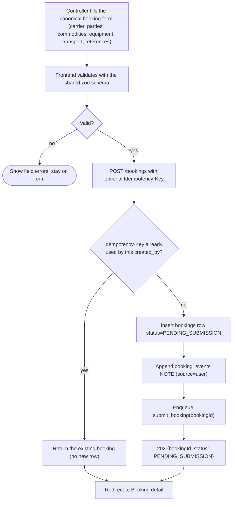
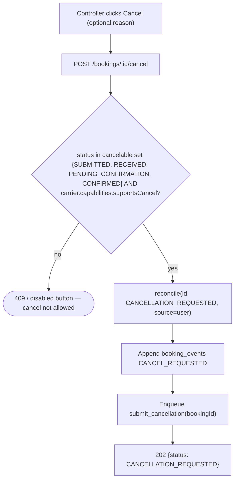
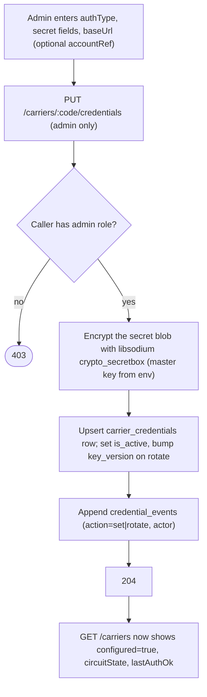
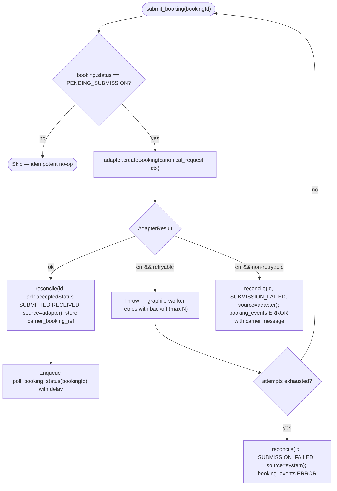
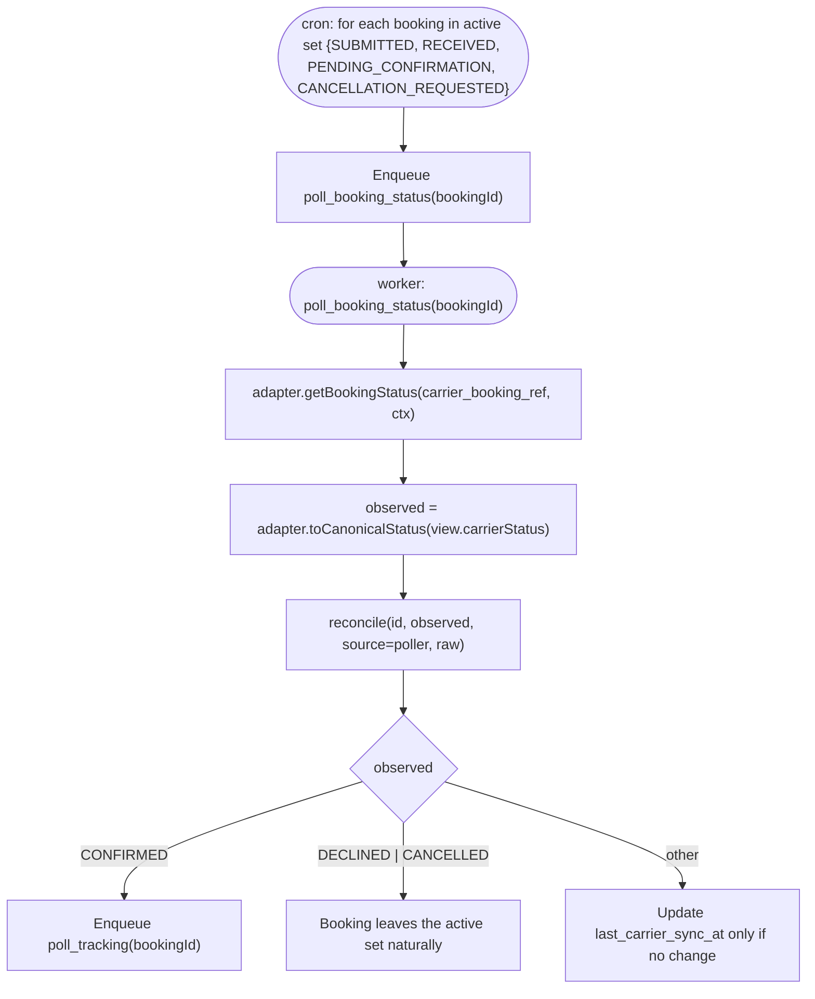
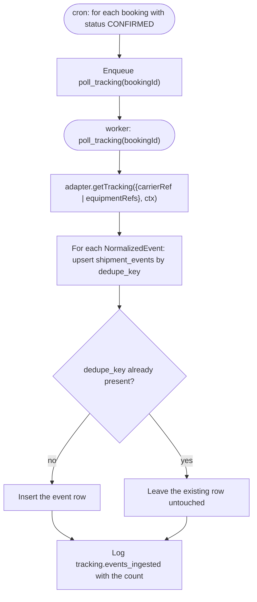
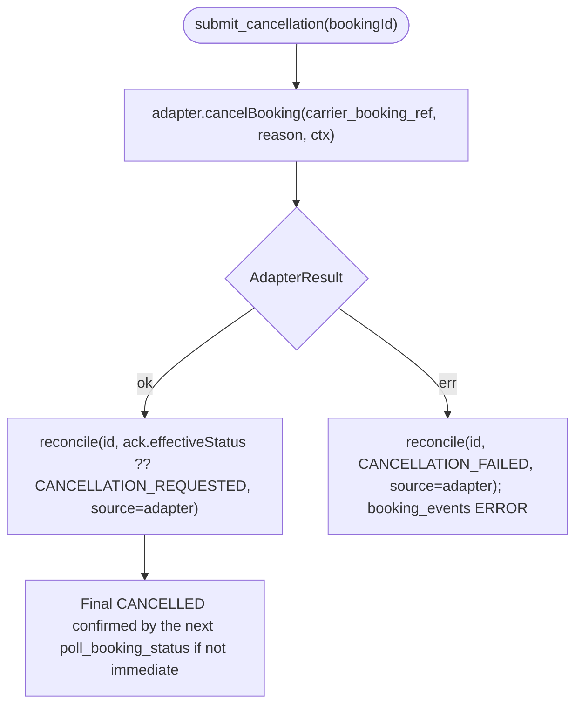
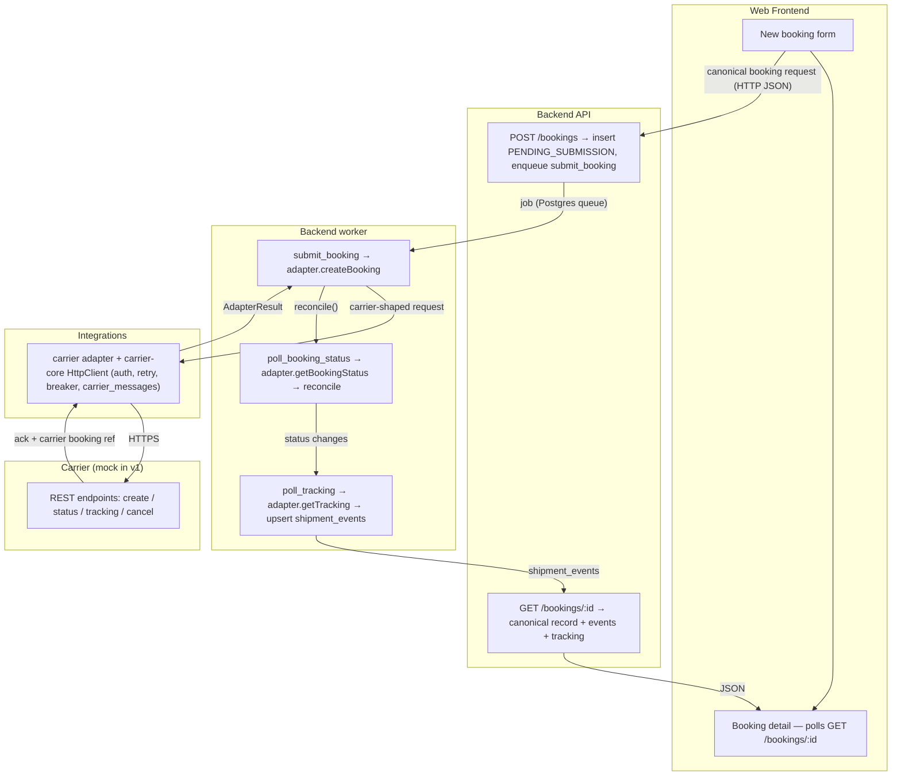

# Flows

> **TL;DR**: operator flows (create / cancel / credential admin), worker flows (submit / poll status / poll tracking / submit cancellation), and one end-to-end lifecycle · developers per layer + QA · read when building or testing a feature.

> Flow types for `web-app`: **User flows (web)**, **Backend / system flows**, **Cross-cutting flows**. All carrier calls happen inside worker jobs; the API never calls a carrier during a request (spec §9).

## User flows (web)

### F-U-001: Create a booking
<!-- BIND: confirmed=C-FL-01 -->

**Actor / Trigger**: operations controller submits the New booking form.

**Definition of Done**:
- [ ] A valid submit creates exactly one `bookings` row with `status = PENDING_SUBMISSION` and one `booking_events` NOTE row.
- [ ] A `submit_booking` job is enqueued for that booking id.
- [ ] Re-POST with the same `Idempotency-Key` and `created_by` returns the first booking and creates no second row or job.
- [ ] Invalid payload returns 4xx with field-level errors and creates nothing.
- [ ] Response is `202` with `{ bookingId, status: "PENDING_SUBMISSION" }`; the UI lands on the detail screen.

**Source**: PRD §7, §9, §15.

---

### F-U-002: Cancel a booking
<!-- BIND: confirmed=C-FL-02 -->

**Actor / Trigger**: operations controller clicks Cancel on Booking detail.

**Definition of Done**:
- [ ] Cancel is offered only when the status is in the cancelable set and the carrier supports cancel.
- [ ] A successful request moves the booking to `CANCELLATION_REQUESTED`, appends a `CANCEL_REQUESTED` event, and enqueues `submit_cancellation`.
- [ ] A disallowed cancel changes no state and returns a clear error.

**Source**: PRD §7, §9.

---

### F-U-003: Set or rotate a carrier credential
<!-- BIND: confirmed=C-FL-03 -->

**Actor / Trigger**: platform administrator submits the credential form on the Carriers / settings screen.

**Definition of Done**:
- [ ] Only an `admin` can call the endpoint; others get 403.
- [ ] The stored `secret_encrypted` is ciphertext; the plaintext never appears in logs or `carrier_messages`.
- [ ] Exactly one active credential row exists per carrier after the write (partial unique index holds).
- [ ] A `credential_events` row is appended with the actor and action.
- [ ] `GET /carriers` reflects the new credential health without exposing secret material.

**Source**: PRD §7, §13.

## Backend / system flows

### F-S-001: submit_booking worker job
<!-- BIND: confirmed=C-FL-04 -->

**Trigger**: `submit_booking(bookingId)` dequeued.
**Inputs**: the `bookings` row, the resolved carrier adapter, a built `AdapterContext` (decrypted credential, bound HTTP client).

**Outputs**: updated `bookings.status`, `carrier_booking_ref`, `booking_events` rows; a `carrier_messages` row for the exchange; possibly a `poll_booking_status` job.

**Definition of Done**:
- [ ] Re-running the job when status is no longer `PENDING_SUBMISSION` does nothing.
- [ ] On carrier ack the booking moves to `SUBMITTED` or `RECEIVED`, `carrier_booking_ref` is stored, and a status poll is scheduled.
- [ ] A retryable error retries with backoff up to the configured max, then lands in `SUBMISSION_FAILED` with an `ERROR` event.
- [ ] A non-retryable error lands in `SUBMISSION_FAILED` immediately, surfacing the carrier validation message.
- [ ] Every attempt writes one `carrier_messages` row with the correlation id, secrets redacted.

**Source**: PRD §8, §9, §16. Retry max N — OQ-CN-7.

---

### F-S-002: poll_booking_status (cron + worker)
<!-- BIND: confirmed=C-FL-05 -->

**Trigger**: cron every `POLL_INTERVAL_BOOKING_MIN` enqueues one job per booking in the active set; also enqueued on demand by `POST /bookings/:id/refresh`.

**Definition of Done**:
- [ ] A changed carrier status is written via `reconcile` with `source = poller` and a `STATUS_CHANGE` event; `last_carrier_sync_at` is updated.
- [ ] An unchanged status updates only `last_carrier_sync_at`.
- [ ] Reaching `CONFIRMED` enqueues `poll_tracking`.
- [ ] `DECLINED` / `CANCELLED` drop out of the polled set.
- [ ] An illegal transition reported by the carrier is logged and dropped, not applied.

**Source**: PRD §9. Poll interval value — OQ-CN-6.

---

### F-S-003: poll_tracking (cron + worker)
<!-- BIND: confirmed=C-FL-06 -->

**Trigger**: cron every `POLL_INTERVAL_TRACKING_MIN` enqueues one job per booking with status `CONFIRMED`; also enqueued after a booking reaches `CONFIRMED` and by `POST /bookings/:id/refresh`.

**Definition of Done**:
- [ ] New tracking events are inserted; events whose `dedupe_key` already exists are ignored.
- [ ] Tracking never changes `bookings.status` in v1.
- [ ] Each poll writes one `carrier_messages` row and logs the ingested count.

**Source**: PRD §9. No delivered-state stop condition — OQ-FL-1.

---

### F-S-004: submit_cancellation worker job
<!-- BIND: confirmed=C-FL-07 -->

**Trigger**: `submit_cancellation(bookingId)` dequeued after F-U-002.

**Definition of Done**:
- [ ] A successful cancel moves the booking to `CANCELLED` (or stays `CANCELLATION_REQUESTED` until a poll confirms).
- [ ] A failed cancel moves the booking to `CANCELLATION_FAILED` with an `ERROR` event and a carrier message.
- [ ] The job is safe to re-run (guarded by current status).

**Source**: PRD §9.

## Cross-cutting flows

### F-C-001: End-to-end booking lifecycle
<!-- BIND: confirmed=C-FL-08 -->

**Actor**: operations controller.
**Layers involved**: Web Frontend, Backend API, Backend worker, Integrations (adapter + `carrier-core`), Carrier (mock in v1).

**Definition of Done**:
- [ ] A booking created in the UI reaches `CONFIRMED` in the UI without any carrier portal login, driven entirely by worker polling against the mock.
- [ ] Every handoff (form → API → queue → adapter → carrier → reconcile → API → UI) succeeds on the happy path.
- [ ] A carrier failure at the adapter hop surfaces as a `SUBMISSION_FAILED` booking visible in the UI, not a lost request.
- [ ] Tracking events appear on the detail screen after the booking is `CONFIRMED`.
- [ ] All carrier exchanges are recorded in `carrier_messages` with correlation ids.

**Source**: PRD §7, §8, §9, §11, §15.

---

## Sources

- PRD §7 (Internal API surface), §8 (CarrierAdapter interface), §9 (Async processing), §11 (Mock carrier servers), §15 (Frontend), §16 (Observability)

## Out of Scope

- Webhook-driven status ingestion (seam only — spec §5, §8).
- Shipping Instruction, amendment, schedule-search flows (v2 — spec §2).
- Bulk create / bulk cancel (spec §2).
