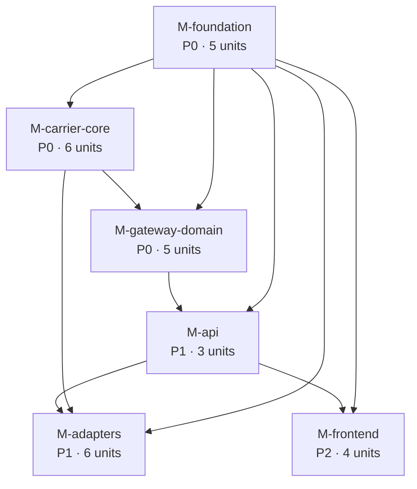
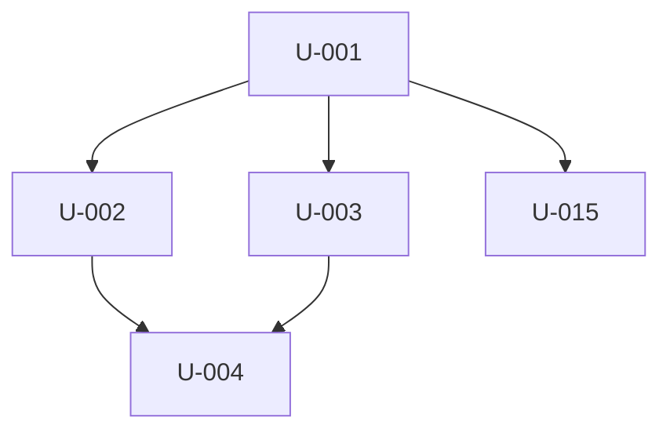
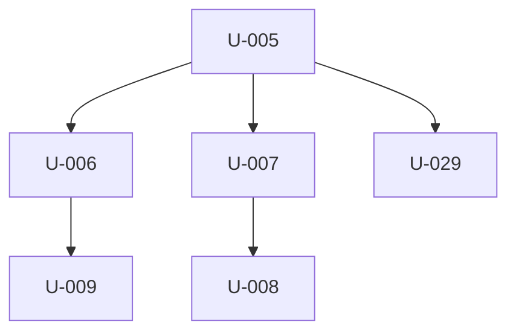
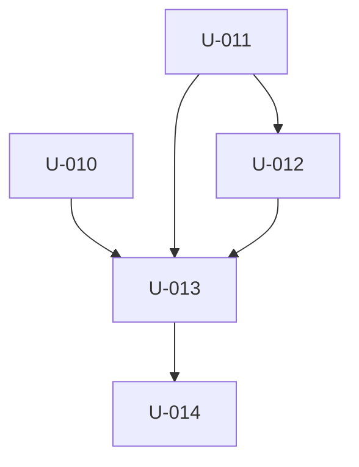
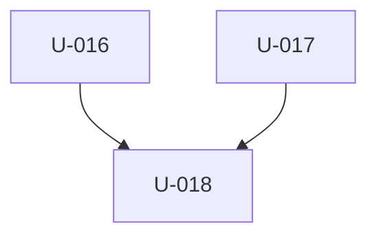
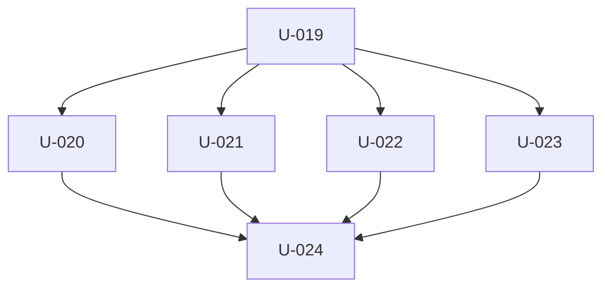
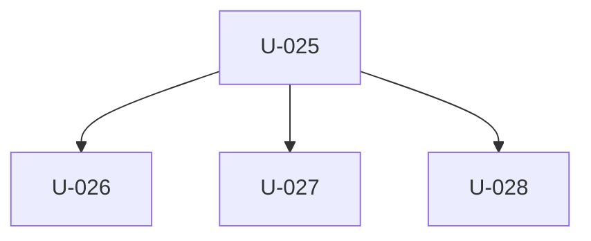

# Units index — Carrier Booking Gateway

**29 units** across **6 modules**. Greenfield (mode `new`); every unit `task_type: create`, `grounding_confidence: MEDIUM`. Source spec: `docs/superpowers/specs/2026-09-01-carrier-booking-gateway-design.md` §17 build decomposition.

## Cross-module dependency graph

## Suggested topological execution order

Waves (units in the same wave have no dependency on each other and may run in parallel):

1. **U-001**
2. **U-002**, **U-003**, **U-005**, **U-015**
3. **U-004**, **U-006**, **U-007**, **U-019**, **U-029**
4. **U-008**, **U-009**, **U-011**, **U-025**
5. **U-010**, **U-012**, **U-020**, **U-021**, **U-022**, **U-023**
6. **U-013**, **U-016**
7. **U-014**, **U-017**, **U-026**, **U-027**
8. **U-018**, **U-024**, **U-028**

---

## M-foundation — Monorepo foundation & shared packages

**Priority** P0 · **Status** 0/5 complete

**Definition of Done**
- [ ] pnpm install + build + typecheck green on the empty scaffold
- [ ] All 7 tables migrate up/down cleanly; carriers table seeded
- [ ] GET /health returns 200 with db + worker heartbeat fields

| ID | Title | task_type | depends_on | status |
|----|-------|-----------|------------|--------|
| U-001 | Scaffold the pnpm monorepo skeleton and CI | create | — | — |
| U-002 | Scaffold apps/booking (Fastify service + env config + health route) | create | U-001 | — |
| U-003 | Build packages/db (pg pool + migration runner + base types) | create | U-001 | — |
| U-004 | Write the booking schema migrations + carrier seed + graphile-worker install | create | U-002, U-003 | — |
| U-015 | Build packages/auth (session/JWT verify + RBAC middleware) | create | U-001 | — |

## M-carrier-core — packages/carrier-core

**Priority** P0 · **Status** 0/6 complete

**Definition of Done**
- [ ] HttpClient unit tests pass (retry, circuit breaker, OAuth2 token cache)
- [ ] A FakeAdapter passes ContractTestKit
- [ ] packages/edifact round-trips a canonical booking through IFTMBF

| ID | Title | task_type | depends_on | status |
|----|-------|-----------|------------|--------|
| U-005 | carrier-core canonical types, zod schemas, and the status transition table | create | U-001 | — |
| U-006 | Define the CarrierAdapter interface, AdapterContext, and adapter registry type | create | U-005 | — |
| U-007 | Build the carrier-core HttpClient (timeout, retry/backoff, circuit breaker, message log hook) | create | U-005 | — |
| U-008 | Implement carrier-core auth strategies (OAuth2 client-credentials, API key, JWT bearer) | create | U-007 | — |
| U-009 | Build the ContractTestKit (standard create → status → tracking → cancel suite) | create | U-006 | — |
| U-029 | Build the packages/edifact seam (translator interface + working IFTMBF reference) | create | U-005 | — |

## M-gateway-domain — Domain services & async worker

**Priority** P0 · **Status** 0/5 complete

**Definition of Done**
- [ ] Full lifecycle test (create → poll → confirm → cancel) passes against a real Postgres using FakeAdapter
- [ ] statusReconciler is the only writer of bookings.status / booking_events

| ID | Title | task_type | depends_on | status |
|----|-------|-----------|------------|--------|
| U-010 | Implement CredentialStore + PgCredentialStore (encrypted carrier secrets) | create | U-004, U-006 | — |
| U-011 | Implement statusReconciler — the single writer of booking status and events | create | U-004, U-005 | — |
| U-012 | Implement bookingService and trackingService (create, cancel guard, refresh, reads) | create | U-011 | — |
| U-013 | Implement worker tasks and cron enqueuers (submit / poll status / poll tracking / cancel) | create | U-007, U-008, U-010, U-011, U-012 | — |
| U-014 | FakeAdapter fixture + full booking-lifecycle test against real Postgres | create | U-009, U-013 | — |

## M-api — Internal API

**Priority** P1 · **Status** 0/3 complete

**Definition of Done**
- [ ] API integration tests cover roles, idempotency, validation errors, /health

| ID | Title | task_type | depends_on | status |
|----|-------|-----------|------------|--------|
| U-016 | Implement the /bookings API routes (create, list, detail, cancel, refresh, events, tracking) | create | U-012, U-015 | — |
| U-017 | Implement /carriers, /tracking, and the full /health routes | create | U-010, U-013, U-015 | — |
| U-018 | API integration test suite (roles, idempotency, validation, health) with FakeAdapter | create | U-014, U-016, U-017 | — |

## M-adapters — Carrier adapters & mock servers

**Priority** P1 · **Status** 0/6 complete

**Definition of Done**
- [ ] Each adapter is green against its mock via ContractTestKit
- [ ] End-to-end via the API with mock base URLs: a booking reaches CONFIRMED without any carrier portal login

| ID | Title | task_type | depends_on | status |
|----|-------|-----------|------------|--------|
| U-019 | Build apps/mock-carriers (scripted REST mocks for ONE, Maersk, HMM, Evergreen) | create | U-002 | — |
| U-020 | Implement the ONE (ONEY) carrier adapter | create | U-008, U-009, U-019 | — |
| U-021 | Implement the Maersk (MAEU) carrier adapter | create | U-008, U-009, U-019 | — |
| U-022 | Implement the HMM (HDMU) carrier adapter | create | U-008, U-009, U-019 | — |
| U-023 | Implement the Evergreen (EGLV) carrier adapter | create | U-008, U-009, U-019 | — |
| U-024 | Wire the adapter registry and the end-to-end mock integration test | create | U-016, U-017, U-020, U-021, U-022, U-023 | — |

## M-frontend — Thin operator UI

**Priority** P2 · **Status** 0/4 complete

**Definition of Done**
- [ ] Manual run of create / cancel / track against the mock carriers works end to end

| ID | Title | task_type | depends_on | status |
|----|-------|-----------|------------|--------|
| U-025 | Scaffold the apps/booking/web frontend (Vite + React 19 shell, auth guard, API client) | create | U-002, U-015 | — |
| U-026 | Build the Bookings list and New booking screens | create | U-025, U-016 | — |
| U-027 | Build the Booking detail screen (tabs, cancel, refresh) | create | U-025, U-016 | — |
| U-028 | Build the Carriers / settings admin screen | create | U-025, U-017 | — |

---

## Open questions carried into units (binding_refs)

| OQ | Priority | Carried by units |
|----|----------|------------------|
| OQ-CN-1 (carrier credentials pending) | P1 business | U-024 |
| OQ-CN-2 (HMM Korean registration) | P1 business | U-022 |
| OQ-CN-3 (legal review of API T&C) | P1 business | U-024 |
| OQ-CN-4 (ownership of failed-booking queue) | P2 business | U-017, U-027 |
| OQ-CN-5 (build-direct vs aggregator) | P2 business | U-024 |
| OQ-CN-6 (poll interval values) | P2 business | U-013 |
| OQ-CN-7 (timeout / circuit threshold / retry N) | P3 business | U-007, U-013 |
| OQ-DM-1 (idempotency-key TTL) | P2 business | U-016 |
| OQ-DM-2 (HMM/Evergreen proprietary payloads) | P2 business | U-019, U-022, U-023 |
| OQ-FL-1 (tracking poll stop condition) | P3 business | U-013 |
| OQ-AR-1 (Fastify vs Express) | P2 tech | U-002 |
| OQ-AR-2 (graphile-worker vs hand-rolled queue) | P2 tech | U-004, U-013 |
| OQ-AR-3 (Node / pnpm versions) | P2 tech | U-001 |
| OQ-AR-4 (libsodium Node binding) | P2 tech | U-010 |
| OQ-AR-5 (internal-user auth implementation) | P2 tech | U-015 |
| OQ-AR-6 (CI ephemeral Postgres) | P3 tech | U-001, U-014 |
